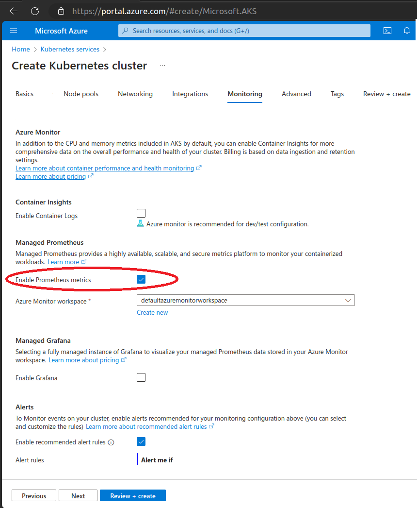

# Azure Monitor Managed Prometheus

[Azure Monitor managed service for Prometheus](https://learn.microsoft.com/en-us/azure/azure-monitor/essentials/prometheus-metrics-overview) can be used when deploying AKS clusters. It can be used in one of two ways:

1.  Remote-write from self-managed Prometheus - in this case you deploy your own Prometheus stack and use its remote-write capabilities. See [remote-write protocol to an Azure Monitor Workspace](https://learn.microsoft.com/en-us/azure/azure-monitor/essentials/remote-write-prometheus) for configuration details.

	You must also follow the [general instructions](../../../requirements.md) to deploy the required exporters. Ensure that all of the metrics, required by Densify, are being collected. See [Required Prometheus Metrics](../../../docs).

2.  Prometheus-Enabled AKS Cluster - Azure allows you to enable metrics collection from your AKS cluster and send these to your Azure Monitor Prometheus workspace.

This example shows you how to setup the data forwarder using either option. You then need to connect to your Azure Managed Prometheus (AzMP) observability platform and send container data to Densify on an hourly basis.

## Prerequisites

You need to setup the following prerequisites before deploying the data forwarder:

1. A Linux environment with `bash` and the following utilities:

	- [Azure CLI](https://learn.microsoft.com/en-us/cli/azure/install-azure-cli)
	- [kubectl](https://kubernetes.io/docs/tasks/tools/#kubectl)
	- [jq](https://jqlang.github.io/jq/)
	- base64 - this is pre-installed in most Linux distros as part of the `coreutils` package.

2. An Azure Monitor workspace. See [Azure Monitor workspace](https://learn.microsoft.com/en-us/azure/azure-monitor/essentials/azure-monitor-workspace-overview).

3. Download the following files and scripts and save them to your workspace:
	- ama-metrics-settings-configmap.yaml
	- configmap.yaml
	- cronjob.yaml
	- pod.yaml
	- register-app-create-secret.sh
	- setup-azmp-aks-cluster.sh

## Enabling Metrics Collection - Option 1 (remote-write)

If you are using remote-write from self-managed Prometheus (option 1):

1. Configure the collection of Prometheus metrics from each cluster to your workspace. Ensure that all of the metrics required by Densify are collected - see [Required Prometheus Metrics](../../../docs).

2. Configure each cluster name, from which you are collecting data, on your Prometheus server or collector. Both the label name and the value are required for `configmap.yaml`.

## Enabling Metrics Collection - Option 2 (Prometheus-Enabled AKS Cluster)

Azure allows you to enable metrics collection from your AKS cluster and send these to your Azure Monitor workspace. This is done by enabling the feature and adding the workspace name in the `Managed Prometheus` section of the `Monitoring` tab in Azure Portal.

However, the default Azure AKS monitoring stack does not collect all of the metrics required by Densify for its container analysis, so you need to modify the default configuration:

1. Edit the first five lines of the script, [setup-azmp-aks-cluster.sh](./setup-azmp-aks-cluster.sh) as follows:

	> CLUSTER_NAME=<my_azure_aks_cluster_name>

	> RESOURCE_GROUP=<my_azure_aks_cluster_resourcegroup>

	> WORKSPACE_RESOURCE_ID=<my_azure_monitor_workspace_resourceid>

	> AZMP_ALREADY_ENABLED=1
	- Leave the value set to 1 if you have enabled 'Managed Prometheus' in the Azure Portal, as shown in the image above.
	- Set the value to 0 if 'Managed Prometheus' is not enabled.

	> ADD_TO_KUBECONFIG=1
	- Leave the value set to 1 if this is a new cluster which has not yet been added to your kubeconfig.
	- Set the value to 0 if this is not a new cluster and it is already included in your kubeconfig.

	Editing these lines ensures all of the required metrics are collected.

2. Run the shell script using:

    `./setup-azmp-aks-cluster.sh`

3. Verify the script runs and completes successfully.

`Note:` While the script runs it disables Azure Monitor Metrics (if already enabled) and then re-enables it. It may take a few minutes to stop and restart the Azure Monitor Metrics.

## Obtaining the Workspace's Resource ID

1. In the Azure Portal navigate to to `Monitor -> Managed Prometheus` and select your workspace.

2. Locate the `Query endpoint` value (ending with `prometheus.monitor.azure.com`). Copy it and paste it into `configmap.yaml` under the parameter `prometheus.url.host`. Save the file.

3. Additionally, locate the `JSON view` and click on it to get the `Resource ID` value. Copy the value.

4. Edit the script, [register-app-create-secret.sh](./register-app-create-secret.sh). Paste the `Resource ID` into the `AZMON_WORKSPACE_RESOURCE_URI` parameter and save the updated script.

## Registering an Entra Service Principal and Creating the Secret

1. In order to run PromQL queries with the Azure Managed Prometheus API, you need to register a Microsoft Entra (formerly Azure AD) service principal and assign the relevant role. See [Query Prometheus metrics using the API and PromQL](https://learn.microsoft.com/en-us/azure/azure-monitor/essentials/prometheus-api-promql).

2. You also need to register Prometheus to request authorization tokens, See [Register an App to request authorization tokens and work with APIs](https://learn.microsoft.com/en-us/azure/azure-monitor/logs/api/register-app-for-token?tabs=cli).

3. You already added your workspace ID to the script [register-app-create-secret.sh](./register-app-create-secret.sh) above, so you can run the shell script using:

	`register-app-create-secret.sh`

4. Verify the script runs and completes successfully. This script does the following:

	- Creates the service principal;
	- Assigns the relevant role to the new service principal;
	- Creates the file, `azmon-secret.yaml` for a Kubernetes secret with the service principal ID

5. Create the Azure Monitor secret in Kubernetes:

    `kubectl create -f azmon-secret.yaml -n <namespace>`

## Deploying the Data Forwarder

You have already added the details of your AzMP workspace to the `configmap.yaml`.  Now, you edit the file to add the remaining connectivity details.

1. Add your Densify instance details.
2. Add cluster name and unique identifiers for all clusters to be analyzed.
3. Create the config map in Kubernetes:

    `kubectl create -f configmap.yaml -n <namespace>`

4. Test your configuration using the test pod:

    `kubectl create -f pod.yaml -n <namespace>`

	Once the collected container data is sent to Densify, the pod exits.

5. Review the log for the container:

	`kubectl logs densify -n <namespace>`

	You should see lines similar to the following, near the end of the log:

	> {"level":"info","pkg":"default","time":1704496040349770,"caller":"src/container/forwarderv2/files.go:98","goid":1,"message":"cluster : cluster-1, zipping cluster-1.zip, contents: cluster - 21 files; container - 16 files; node - 17 files; node_group - 0 files; hpa - 0 files; rq - 0 files; crq - 0 files; `total - 54 files`"}

	> {"level":"info","pkg":"default","time":1704496040449763,"caller":"src/container/forwarderv2/files.go:98","goid":1,"message":"cluster : cluster-2, zipping cluster-2.zip, contents: cluster - 21 files; container - 16 files; node - 17 files; node_group - 0 files; hpa - 0 files; rq - 0 files; crq - 0 files; `total - 54 files`"}

	> {"level":"info","pkg":"default","file":"data/cluster-1.zip","time":1704496040616014,"caller":"src/container/forwarderv2/main.go:57","goid":1,"message":"`file uploaded successfully`"}

	> {"level":"info","pkg":"default","file":"data/cluster-2.zip","time":1704496040666046,"caller":"src/container/forwarderv2/main.go:57","goid":1,"message":"`file uploaded successfully`"}

	The exact number of files in each subfolder and the total number of files will depend on:
	- The data forwarder's `collection.include` setting;
	- Configuration of `kube-state-metrics`;
	- Details of the Kubernetes cluster, from which the data is being collected (i.e what is defined/running in the cluster).

	If you use the default `collection.include` configuration, at the very least you should see files for the cluster, container and node. Other files are cluster-specific.

	If the number of files is lower than expected, there may be issues sending container data to Densify and you need to review the log for more details and contact support@densify.com for help.

6. Cleanup

    `kubectl delete -f pod.yaml -n <namespace>`

7. Create the CronJob using `cronjob.yaml`

    `kubectl create -f cronjob.yaml -n <namespace>`

	The CronJob runs and sends the collected container data to Densify hourly. You need to adjust the CronJob schedule to run on the same `collection.interval_size`, defined in the config map.
